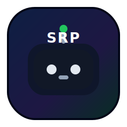
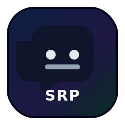

<p align="center">
  
</p>

<p align="center">
  Discord bot + Next.js admin panel for <strong>SRP Legacy</strong> — full faction management, button-based role requests, channel guide embeds, and auto-role automation.
</p>

<p align="center">
  
  
</p>

---

## Features

| Area | Description |
|---|---|
| **Faction structure** | 10-faction Discord server setup — auto-creates categories, text/voice channels, and hierarchical roles (`Лидер`, `Зам. Лидера`, `Участник`) per faction |
| **Role requests** | Button-based flow: player clicks → selects faction → approval embed → leaders/deputies approve → bot grants role automatically |
| **WebUI dashboard** | Next.js 16 admin panel (port 5031) with dark glassmorphism UI — manages guides, embeds, auto-roles, faction viewer, and role requests |
| **Channel guides** | Dynamic guide embeds per faction — shows channels, roles, descriptions; send/edit directly from WebUI to Discord |
| **Embed builder** | Create, edit, duplicate, and send rich embeds to any Discord channel; edit previously sent messages |
| **Auto-roles** | Configure roles automatically assigned to new members via WebUI |
| **Recruitment workflow** | Policy-driven architecture via `recruitment-architecture.json` |
| **Health checks** | Systemd timers, Telegram notifications, and healthcheck scripts |

---

## Quick start

### 1) Install

```bash
npm ci
cd webui && npm ci
```

### 2) Configure environment

```bash
cp .env.example .env
```

Required variables in `.env`:

| Variable | Purpose |
|---|---|
| `DISCORD_TOKEN` | Bot token |
| `GUILD_ID` | Target Discord server |
| `PORT` | Express API port (default `5032`) |
| `WEBUI_AUTH_TOKEN` | Shared secret for WebUI ↔ API auth |

WebUI environment (`webui/.env.local`):

| Variable | Purpose |
|---|---|
| `DISCORD_API_URL` | Bot API URL (default `http://localhost:5032`) |
| `WEBUI_AUTH_TOKEN` | Must match the bot's `.env` value |

### 3) Run

```bash
# Bot (Express API on port 5032)
node src/index.js

# WebUI (Next.js on port 5031)
cd webui && npm run build && npm start -- -p 5031
```

### 4) Production (systemd)

```bash
sudo cp srp-legacy-bot.service srp-legacy-webui.service /etc/systemd/system/
sudo systemctl daemon-reload
sudo systemctl enable --now srp-legacy-bot srp-legacy-webui
```

---

## Architecture

```
┌──────────────────┐       ┌──────────────────┐       ┌─────────────┐
│  Next.js WebUI   │──────▶│  Express API     │──────▶│  Discord    │
│  :5031           │ proxy │  :5032           │  d.js │  Gateway    │
│  (Cloudflare)    │  routes│  (index.js)      │       │             │
└──────────────────┘       └──────────────────┘       └─────────────┘
```

- **WebUI** → Next.js App Router with proxy API routes (`/api/proxy/*`) that forward to the Express backend
- **Bot** → Discord.js v14 client + Express server exposing JSON API endpoints
- **Auth** → All proxy routes include `WEBUI_AUTH_TOKEN` header

---

## Faction system

10 factions deployed via `factionManager.js`:

| # | Faction | Tag | Emoji |
|---|---------|-----|-------|
| 1 | Мэрия | MAYOR | 🏛️ |
| 2 | LSPD | LSPD | 🚔 |
| 3 | SFPD | SFPD | 🛡️ |
| 4 | LVPD | LVPD | 🏜️ |
| 5 | ФБР | FBI | 🕵️ |
| 6 | МО | MO | 🎖️ |
| 7 | Больница ЛС | MEDLS | 🏥 |
| 8 | Больница СФ | MEDSF | ⚕️ |
| 9 | Больница ЛВ | MEDLV | 🩺 |
| 10 | Автошкола | DRIVE | 🚗 |

Each faction auto-creates:
- **Category**: `{emoji} {title}`
- **Text channels**: 📌│объявления, 💬│общий-чат, 🤝│обсуждения-1на1, 👥│обсуждения-2на2
- **Voice channels**: 🔊 Совещание, 🎙️ Рабочая, 🤝 Голос 1×1, 👥 Голос 2×2
- **Roles**: `{emoji} {TAG} │ Лидер`, `{emoji} {TAG} │ Зам. Лидера`, `{emoji} {TAG} │ Участник`

Deploy from WebUI (`/factions`) or via the bot API.

---

## Role requests (button-based)

1. Player clicks the **Запросить роль** button in the role-request channel
2. Selects a faction and role level from the dropdown
3. Bot posts an approval embed to the approvals channel
4. Faction leaders / deputies click **Одобрить** or **Отклонить**
5. Bot auto-grants or denies the role and notifies the player

Legacy text commands are still supported:
- `!роль <лидер|зам|база> @user <reason>` in `📝│запросы-ролей`
- `!одобрить <ID>` / `!отклонить <ID> <reason>` in `🔐│одобрение-ролей`

---

## WebUI pages

| Route | Description |
|---|---|
| `/` | Dashboard overview |
| `/factions` | Faction structure viewer & deploy |
| `/guides` | Channel guide embeds — per-faction dynamic content, send/edit to Discord |
| `/embeds` | Embed builder — create, edit, duplicate, send, update sent messages |
| `/roles` | Auto-roles configuration |
| `/role-requests` | Role request management & panel setup |
| `/stats` | Server statistics |

---

## API endpoints (Express, port 5032)

| Method | Path | Description |
|---|---|---|
| GET | `/api/channels` | List guild text channels |
| GET | `/api/roles` | List guild roles |
| GET | `/api/auto-roles` | Get auto-role configuration |
| POST | `/api/auto-roles` | Save auto-role configuration |
| GET | `/api/structure/live` | Live faction structure from Discord |
| POST | `/api/send-embed` | Send embed to a channel |
| POST | `/api/edit-embed` | Edit a previously sent embed |
| GET | `/api/role-requests` | List pending role requests |
| POST | `/api/role-request/approve` | Approve a role request |
| POST | `/api/role-request/deny` | Deny a role request |
| POST | `/api/role-request/panel` | Deploy role request panel button |

All endpoints require `Authorization: Bearer <WEBUI_AUTH_TOKEN>` header.

---

## Project structure

```
├── src/
│   ├── index.js                  # Main bot + Express API server
│   ├── registerCommands.js       # Slash command registration
│   ├── commands/                 # Slash commands (admin, fun, util)
│   └── utils/
│       ├── embedFactory.js       # Embed template helpers
│       ├── factionManager.js     # 10-faction Discord structure deployment
│       ├── roleRequestManager.js # Button-based role request handler
│       └── telegram.js           # Telegram notification integration
├── webui/                        # Next.js 16 admin panel
│   └── src/app/
│       ├── page.tsx              # Dashboard
│       ├── factions/page.tsx     # Faction viewer
│       ├── guides/page.tsx       # Channel guide embeds
│       ├── embeds/page.tsx       # Embed builder
│       ├── roles/page.tsx        # Auto-roles config
│       ├── role-requests/page.tsx# Role request management
│       ├── stats/page.tsx        # Statistics
│       └── api/proxy/            # Proxy routes → Express API
├── scripts/                      # Setup & maintenance scripts
├── data/                         # Runtime state (gitignored)
├── config.json                   # Bot configuration
└── recruitment-architecture.json # Recruitment workflow policy
```

---

## Security / what not to commit

- Never commit `.env` or `webui/.env.local` (contain tokens)
- Keep secrets in environment variables only
- Files intentionally ignored by git:
  - `.env`, `webui/.env*`
  - `node_modules/`, `logs/`, `backups/`
  - Runtime state under `data/` (`messages.json`, `recruitment-architecture-state.json`, `role-requests.json`, `autoroles.json`, `embeds.json`)
  - Build output (`webui/.next/`)

---

## License

See `LICENSE`.
